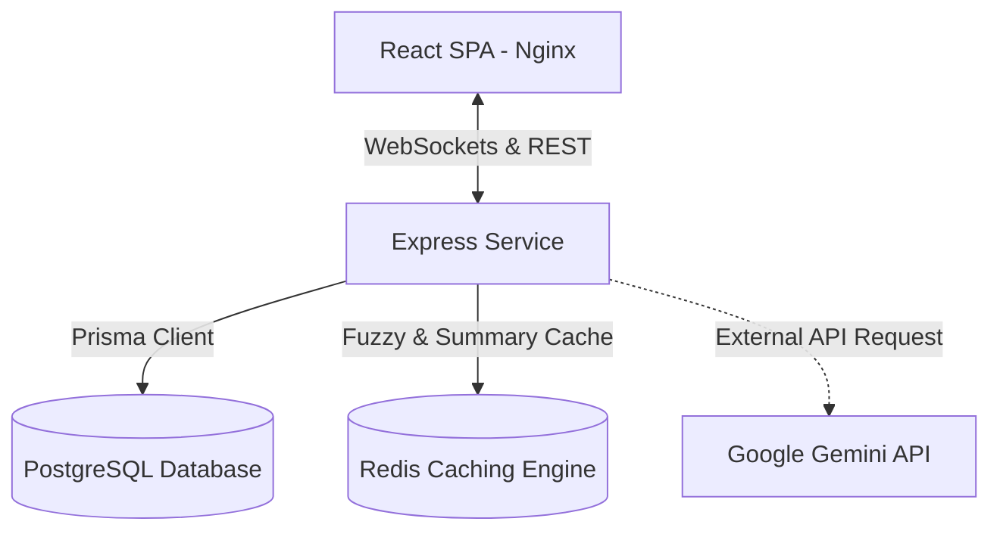

# AuraTask // Production-Grade Project & Task Management Platform

AuraTask is a high-performance, containerized, real-time Project and Task Management platform designed for software teams. It provides user authentication, project workspaces, interactive Kanban board boards, fuzzy search, and AI-powered task summarization.

---

## 🏗️ Architecture Design



### Key Components:
1. **Frontend (React + Vite + TypeScript)**: Styled with custom modern CSS (glassmorphism, interactive glow filters, smooth transitions, dark mode). Uses Zustand for fast, lightweight global state, and Socket.io client for real-time board events. Hosted on a lightweight Nginx container.
2. **Backend (Node.js + Express + TypeScript)**: Exposes REST API endpoints and mounts a Socket.io WebSocket server. Built with clean separation of concerns (routers, controllers, middlewares, services).
3. **Database (PostgreSQL)**: Handles persistent user, project, workspace, membership, and task records. Configured and migrated using Prisma ORM.
4. **Caching & Pub/Sub (Redis)**: Speeds up fuzzy search results (cached for 5 minutes) and AI task summaries (cached for 1 hour). Invalidated automatically on project updates, task mutations, or deletion events.

---

## ⚡ Key Technical Features

### 🔍 Caching & Intelligent Search
Fuzzy searches query both titles and descriptions matching the term `q`.
- **Cache Hit**: Returns cached tasks directly from Redis (`project:<projectId>:search:<query>`), skipping DB querying to keep CPU load low.
- **Cache Invalidation**: Any CRUD activity on tasks within a project scans and deletes stale search cache entries (`project:<projectId>:search:*`) to guarantee immediate consistency.

### 🤖 AI-Generated Task Summaries
Generates concise markdown task outlines:
- Utilizes Google Gemini's API (`gemini-2.5-flash`) when a `GEMINI_API_KEY` is present.
- Falls back to an advanced rules-based local NLP summary service (analyzing tech stacks, verbs, sentence structure, and risks) if the key is absent.
- Stores summaries in the PostgreSQL DB and caches them in Redis (`task:summary:<taskId>`) with a 1-hour expiration time (TTL).

### 📡 Real-Time Status Tracking
Uses WebSocket connections. When users enter a project page, they join a project-specific room (`project_<projectId>`).
- Task creation, update, assignee reassignment, and status changes instantly notify all connected board members.
- Smooth browser notifications display actions without forced browser refreshes.

---

## 🚀 Getting Started (Docker Compose)

The entire platform is orchestratable with a single command. Docker Compose spins up the database, cache engine, backend server, and frontend web server.

### Prerequisites
- Docker & Docker Compose installed.

### Run Instructions
1. Clone this repository and enter the directory.
2. Launch the application:
   ```bash
   docker-compose up --build
   ```
3. Once running, access the user portal at:
   - **Frontend**: [http://localhost:3000](http://localhost:3000)
   - **Backend API**: [http://localhost:5000/api/health](http://localhost:5000/api/health) (to verify health status)

---

## 🧪 Testing

Both backend unit and integration test suites are written using Jest and Supertest.

### Running Backend Tests
1. Navigate to the backend directory:
   ```bash
   cd backend
   ```
2. Install local modules:
   ```bash
   npm install
   ```
3. Run the test suite:
   ```bash
   npm run test
   ```

Test coverage includes:
- User registration and password hashing validation.
- JWT credential logins.
- Project membership authorization.
- Task search caching and database fallback checks.

---

## 📂 Project Structure

```
.
├── backend/
│   ├── prisma/             # Database Schema
│   ├── src/
│   │   ├── controllers/    # Route controllers (auth, projects, tasks)
│   │   ├── middleware/     # JWT authentication parser
│   │   ├── services/       # Prisma client, Redis client, AI summary, Sockets
│   │   └── index.ts        # Server entry point
│   ├── tests/              # Jest test suites
│   ├── Dockerfile
│   └── tsconfig.json
├── frontend/
│   ├── src/
│   │   ├── store/          # Zustand global stores
│   │   ├── App.tsx         # Dashboard and Modal components
│   │   └── index.css       # Layouts, variables, and themes
│   ├── Dockerfile
│   ├── nginx.conf
│   └── vite.config.ts
├── docker-compose.yml
├── postman_collection.json # API Collections
└── README.md
```
